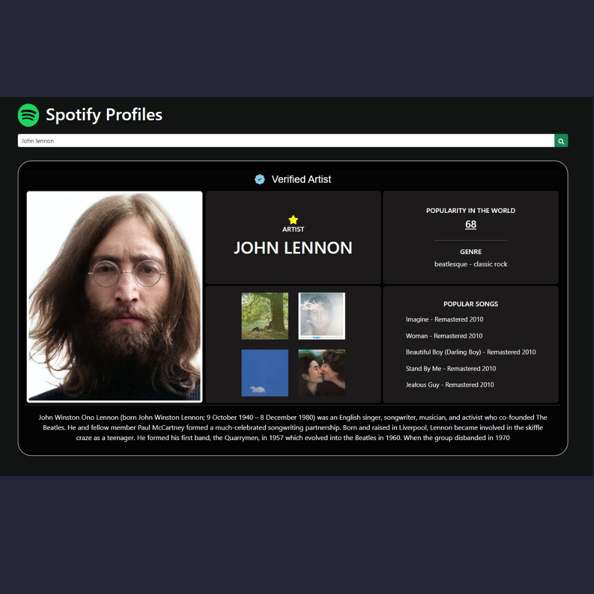

# Spotify Search App 🎵🔍

This is a web application that allows users to search for artists on Spotify and retrieve information about them, including their top tracks, albums, and biography.

## Preview image 👁

## Deployment 📦

- [DEMO](https://spotify-profiles.netlify.app/) - Website

## Features

- Search for artists by name
- View artist information, including their top tracks and albums
- Read the artist's biography
- View popularity

## Technologies Used

- React
- TypeScript
- Vite (build tool)
- Bootstrap (CSS framework)

## API

The application utilizes the Spotify API to fetch artist data, tracks, and albums. Additionally, it uses the Last.fm API to retrieve artist biographies.

- Spotify API: [Documentation](https://developer.spotify.com/documentation/web-api/)
- Last.fm API: [Documentation](https://www.last.fm/api)

## Authors ✒️

- **Lucas Quiroga** - _Initial work_ - [Lucas Quiroga](https://github.com/Lucas-Quiroga)

## License 📄

This project is licensed © LUCAS QUIROGA 2023, all rights reserved.
